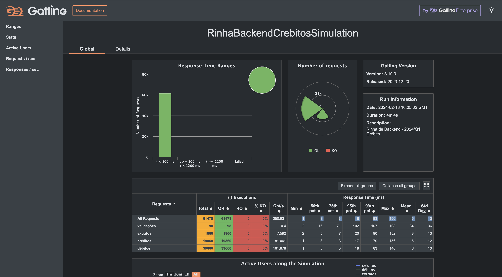

# Rinha de Backend: 2024/Q1 - Crébito

Implementação em golang(1.22.0) para a segunda edição da Rinha de Backend 
- native http handler
- have log implementation: slog
- database pg plugin: github.com/jackc/pgx/v5/pgxpool 

## Para Executar

Para subir o servidor, execute o seguinte comando:
```sh 
go run main.go    
```

De uma olhada no arquivo `Makefile` para mais comandos úteis.

## Conteinerização
Para buildar o projeto, criar a imagem iniciar todos os containers para executar a aplicação execute:
```sh 
make up    
```

## Submissão

O diretório [participacao](https://github.com/Gilmardealcantara/rinha-de-backend-2024-q1/tree/main/participantes/gilmardealcantara) 
contem os artefatos usados para a submissão da Rinha de Backend. Eles também pode ser encontrados na raiz desse projeto.


### docker compose files
https://github.com/Gilmardealcantara/rinha-de-backend-2024-q1/tree/main/participantes/Gilmardealcantara


## Local Results



## sql utils
```sql
SELECT left(query, 10), total_exec_time FROM pg_stat_statements where query like 'INSERT%' or query like 'SELECT%' or query like 'UPDATE%' ORDER BY total_exec_time DESC LIMIT 10;
```

## License

MIT - Copyright © 2024 - Api Golang Rinha de Backend Segunda Edição em Golang

